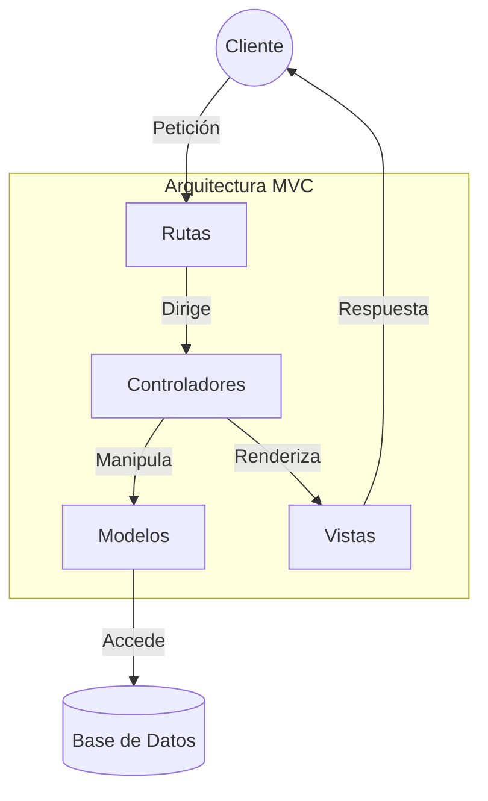
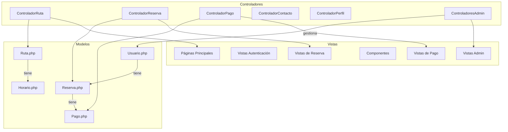
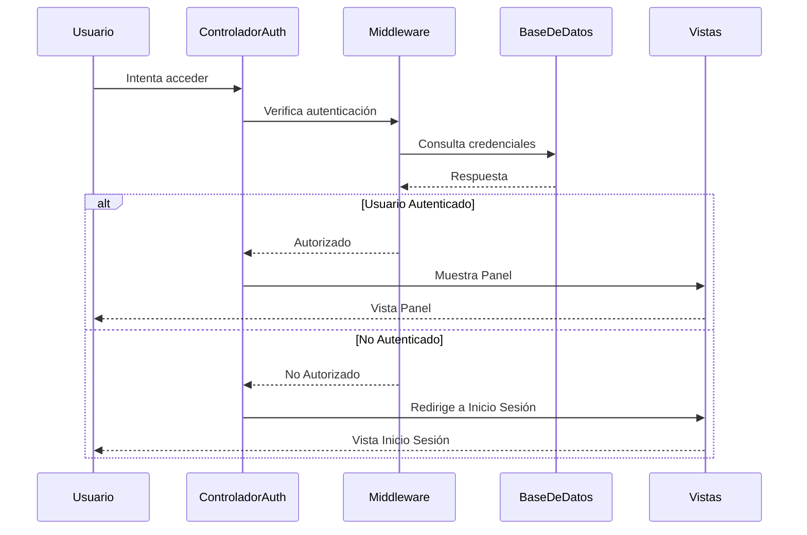
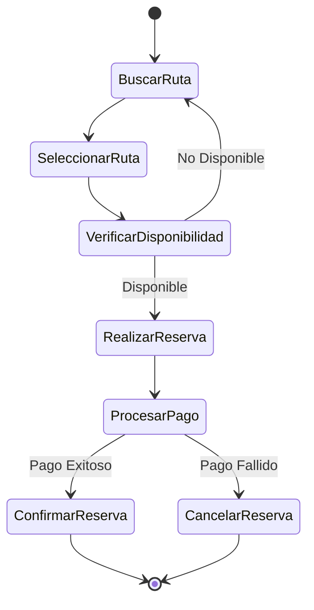

# Estructura MVC del Proyecto

## 📱 Models (app/Models/)

- **User.php**
  - Gestión de usuarios y autenticación
  - Relaciones con reservas y pagos
- **Route.php**
  - Gestión de rutas de viaje
  - Horarios y disponibilidad
- **Reservation.php**
  - Reservas de viajes
  - Estados y relaciones con usuarios
- **Payment.php**
  - Gestión de pagos
  - Integración con pasarela de pago
- **Schedule.php**
  - Programación de horarios
  - Relaciones con rutas

## 🎮 Controllers (app/Http/Controllers/)

### Principales

- **RutaController.php**
  - Búsqueda y visualización de rutas
- **ReservationController.php**
  - Gestión de reservas
  - Proceso de reserva
- **PaymentController.php**
  - Procesamiento de pagos
  - Integración con PayPal
- **ContactoController.php**
  - Formulario de contacto
- **ProfileController.php**
  - Gestión de perfil de usuario

### Administrativos

- **AdminDashboardController.php**
  - Panel de control administrativo
- **AdminReportController.php**
  - Generación de reportes
- **Admin/**
  - Controladores específicos para administración

## 👁 Views (resources/views/)

### Páginas Principales

- **welcome.blade.php**
  - Página de inicio
- **dashboard.blade.php**
  - Panel de usuario
- **about.blade.php**
  - Página de información
- **contacto.blade.php**
  - Formulario de contacto

### Secciones

- **auth/**
  - Vistas de autenticación
- **admin/**
  - Interfaces administrativas
- **payments/**
  - Vistas de proceso de pago
- **reservations/**
  - Gestión de reservas
- **rutas/**
  - Listado y detalles de rutas
- **legal/**
  - Términos y privacidad
- **profile/**
  - Gestión de perfil

### Componentes

- **layouts/**
  - Plantillas base
- **components/**
  - Componentes reutilizables
- **errors/**
  - Páginas de error

## 🛠 Servicios Adicionales

### Services (app/Services/)

- Lógica de negocio compleja
- Servicios de integración

### Middleware (app/Http/Middleware/)

- **AdminMiddleware**
  - Control de acceso administrativo
- Autenticación y autorización

### Providers (app/Providers/)

- Configuración de servicios
- Registro de componentes

## 📊 Diagramas de la Estructura MVC

### Diagrama General de la Arquitectura

### Diagrama Detallado de Componentes

### Diagrama de Flujo de Autenticación

### Diagrama de Proceso de Reserva

