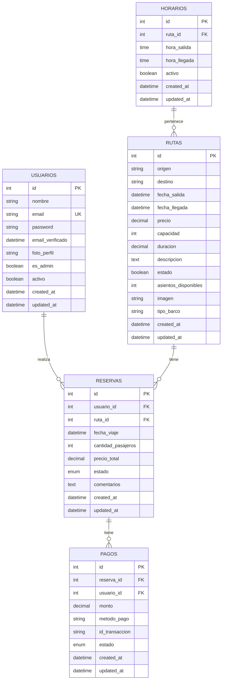

# Diagrama Entidad-Relación de la Base de Datos

## Diagrama ER

## Descripción de Relaciones

1. **USUARIOS - RESERVAS** (1:N)
   
   - Un usuario puede tener múltiples reservas
   - Cada reserva pertenece a un único usuario

2. **RUTAS - RESERVAS** (1:N)
   
   - Una ruta puede tener múltiples reservas
   - Cada reserva está asociada a una única ruta

3. **RESERVAS - PAGOS** (1:N)
   
   - Una reserva puede tener múltiples pagos
   - Cada pago está asociado a una única reserva

4. **RUTAS - HORARIOS** (1:N)
   
   - Una ruta puede tener múltiples horarios
   - Cada horario pertenece a una única ruta

## Notas Adicionales

- La tabla USUARIOS incluye campos para autenticación y gestión de perfiles
- La tabla RUTAS maneja la información de los viajes disponibles
- La tabla RESERVAS gestiona el estado de las reservaciones
- La tabla PAGOS maneja las transacciones financieras
- La tabla HORARIOS gestiona los tiempos de salida y llegada

## Tipos de Datos Especiales

- **enum estado** en RESERVAS: ['pendiente', 'confirmado', 'cancelado']
- **enum estado** en PAGOS: ['pending', 'completed', 'failed', 'refunded']
- **decimal**: Usado para valores monetarios (precio, monto) con 10 dígitos y 2 decimales 
