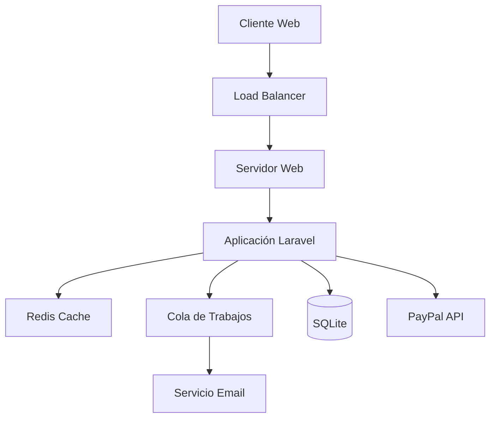

# Manual Técnico - Sistema de Reservas AmazonRiver

## Índice

1. [Arquitectura del Sistema](#arquitectura-del-sistema)
2. [Requisitos Técnicos](#requisitos-técnicos)
3. [Estructura del Proyecto](#estructura-del-proyecto)
4. [Base de Datos](#base-de-datos)
5. [API y Endpoints](#api-y-endpoints)
6. [Autenticación y Seguridad](#autenticación-y-seguridad)
7. [Integración de Pagos](#integración-de-pagos)
8. [Despliegue](#despliegue)
9. [Mantenimiento](#mantenimiento)

## Arquitectura del Sistema

### Stack Tecnológico

- **Backend**: Laravel 10.x
- **Frontend**: Blade + TailwindCSS
- **Base de Datos**: SQLite 3
- **Servidor**: Nginx/Apache
- **Cache**: Redis
- **Cola de Trabajos**: Laravel Queue

### Diagrama de Arquitectura



## Requisitos Técnicos

### Requisitos de Servidor

```bash
# Versiones mínimas requeridas
PHP >= 8.1
SQLite >= 3.8.8
Composer >= 2.0
Node.js >= 16.0
npm >= 8.0

# Extensiones PHP requeridas
php8.1-sqlite3
php8.1-mbstring
php8.1-xml
php8.1-curl
php8.1-zip
php8.1-gd
```

### Configuración del Entorno

```env
APP_NAME=AmazonRiver
APP_ENV=production
APP_DEBUG=false
APP_URL=https://amazonriver.com

DB_CONNECTION=sqlite
# No se necesita DB_HOST, DB_PORT, DB_USERNAME ni DB_PASSWORD para SQLite
# El archivo de base de datos se ubicará en database/database.sqlite

QUEUE_CONNECTION=redis
CACHE_DRIVER=redis
SESSION_DRIVER=redis

PAYPAL_MODE=live
PAYPAL_CLIENT_ID=your_client_id
PAYPAL_SECRET=your_secret
```

## Estructura del Proyecto

### Directorios Principales

```plaintext
amazonriver/
├── app/
│   ├── Http/
│   │   ├── Controllers/
│   │   ├── Middleware/
│   │   └── Requests/
│   ├── Models/
│   └── Services/
├── config/
├── database/
│   ├── migrations/
│   └── seeders/
├── resources/
│   ├── views/
│   ├── js/
│   └── css/
└── routes/
    ├── web.php
    └── api.php
```

### Modelos Principales

```php
// app/Models/User.php
class User extends Authenticatable
{
    protected $fillable = [
        'name',
        'email',
        'password',
        'is_admin',
        'profile_photo'
    ];

    public function reservations()
    {
        return $this->hasMany(Reservation::class);
    }
}

// app/Models/Reservation.php
class Reservation extends Model
{
    protected $fillable = [
        'user_id',
        'ruta_id',
        'fecha_viaje',
        'cantidad_pasajeros',
        'precio_total',
        'estado'
    ];

    public function user()
    {
        return $this->belongsTo(User::class);
    }
}
```

## Base de Datos

### Configuración de SQLite

```bash
# Crear el archivo de base de datos
touch database/database.sqlite

# Establecer permisos adecuados
chmod 664 database/database.sqlite
chown www-data:www-data database/database.sqlite

# Configurar Laravel para usar SQLite
# En config/database.php
'default' => env('DB_CONNECTION', 'sqlite'),
'connections' => [
    'sqlite' => [
        'driver' => 'sqlite',
        'url' => env('DATABASE_URL'),
        'database' => database_path('database.sqlite'),
        'prefix' => '',
        'foreign_key_constraints' => env('DB_FOREIGN_KEYS', true),
    ],
],
```

### Migraciones Principales

```php
// database/migrations/create_rutas_table.php
public function up()
{
    Schema::create('rutas', function (Blueprint $table) {
        $table->id();
        $table->string('origen');
        $table->string('destino');
        $table->dateTime('fecha_salida');
        $table->dateTime('fecha_llegada');
        $table->decimal('precio', 10, 2);
        $table->integer('capacidad')->default(50);
        $table->decimal('duracion', 4, 1);
        $table->text('descripcion')->nullable();
        $table->boolean('estado')->default(true);
        $table->timestamps();
    });
}
```

### Respaldo y Mantenimiento de SQLite

```bash
# Backup de la base de datos
sqlite3 database/database.sqlite ".backup 'backup/database-$(date +%Y%m%d).sqlite'"

# Optimización de la base de datos
sqlite3 database/database.sqlite "VACUUM;"

# Verificar integridad
sqlite3 database/database.sqlite "PRAGMA integrity_check;"
```

## API y Endpoints

### Rutas Web Principales

```php
// routes/web.php
Route::middleware(['auth'])->group(function () {
    Route::get('/dashboard', [DashboardController::class, 'index'])->name('dashboard');

    // Rutas de Reservas
    Route::resource('reservations', ReservationController::class);
    Route::post('/reservations/{reservation}/cancel', [ReservationController::class, 'cancel'])
        ->name('reservations.cancel');

    // Rutas de Pagos
    Route::prefix('payments')->name('payments.')->group(function () {
        Route::get('/{reservation}', [PaymentController::class, 'show'])->name('show');
        Route::post('/{reservation}/process', [PaymentController::class, 'processPayment'])
            ->name('process');
    });
});
```

### Controladores

```php
// app/Http/Controllers/ReservationController.php
class ReservationController extends Controller
{
    public function store(StoreReservationRequest $request)
    {
        $validated = $request->validated();

        $reservation = Reservation::create([
            'user_id' => auth()->id(),
            'ruta_id' => $validated['ruta_id'],
            'fecha_viaje' => $validated['fecha_viaje'],
            'cantidad_pasajeros' => $validated['cantidad_pasajeros'],
            'precio_total' => $this->calculateTotal($validated)
        ]);

        return redirect()->route('payments.show', $reservation);
    }
}
```

## Autenticación y Seguridad

### Middleware de Administrador

```php
// app/Http/Middleware/AdminMiddleware.php
class AdminMiddleware
{
    public function handle($request, Closure $next)
    {
        if (!auth()->check() || !auth()->user()->is_admin) {
            return redirect('/')->with('error', 'Acceso no autorizado.');
        }

        return $next($request);
    }
}
```

### Políticas de Acceso

```php
// app/Policies/ReservationPolicy.php
class ReservationPolicy
{
    public function view(User $user, Reservation $reservation)
    {
        return $user->id === $reservation->user_id || $user->is_admin;
    }

    public function cancel(User $user, Reservation $reservation)
    {
        return $user->id === $reservation->user_id && 
               $reservation->estado !== 'cancelado';
    }
}
```

## Integración de Pagos

### Configuración de PayPal

```php
// config/paypal.php
return [
    'mode' => env('PAYPAL_MODE', 'sandbox'),
    'client_id' => env('PAYPAL_CLIENT_ID'),
    'secret' => env('PAYPAL_SECRET'),
    'webhook_id' => env('PAYPAL_WEBHOOK_ID'),
];
```

### Procesamiento de Pagos

```php
// app/Services/PaymentService.php
class PaymentService
{
    public function processPayment(Reservation $reservation)
    {
        try {
            $payment = Payment::create([
                'reservation_id' => $reservation->id,
                'user_id' => auth()->id(),
                'amount' => $reservation->precio_total,
                'payment_method' => 'paypal'
            ]);

            $paypalOrder = $this->createPayPalOrder($payment);

            return redirect($paypalOrder->getApprovalLink());
        } catch (\Exception $e) {
            Log::error('Error procesando pago: ' . $e->getMessage());
            throw new PaymentException('Error al procesar el pago');
        }
    }
}
```

## Despliegue

### Requisitos de Servidor

```bash
# Instalación de dependencias
composer install --no-dev --optimize-autoloader
npm install
npm run build

# Optimización de Laravel
php artisan config:cache
php artisan route:cache
php artisan view:cache

# Migraciones
php artisan migrate --force
```

### Configuración de Nginx

```nginx
server {
    listen 80;
    server_name amazonriver.com;
    root /var/www/amazonriver/public;

    add_header X-Frame-Options "SAMEORIGIN";
    add_header X-Content-Type-Options "nosniff";

    index index.php;

    charset utf-8;

    location / {
        try_files $uri $uri/ /index.php?$query_string;
    }

    location = /favicon.ico { access_log off; log_not_found off; }
    location = /robots.txt  { access_log off; log_not_found off; }

    error_page 404 /index.php;

    location ~ \.php$ {
        fastcgi_pass unix:/var/run/php/php8.1-fpm.sock;
        fastcgi_param SCRIPT_FILENAME $realpath_root$fastcgi_script_name;
        include fastcgi_params;
    }

    location ~ /\.(?!well-known).* {
        deny all;
    }
}
```

## Mantenimiento

### Tareas Programadas

```php
// app/Console/Kernel.php
protected function schedule(Schedule $schedule)
{
    // Backup de base de datos SQLite
    $schedule->command('db:backup')->daily()->at('01:00');

    // Optimización de SQLite
    $schedule->command('db:optimize')->weekly();

    // Otras tareas...
    $schedule->command('reservations:clean')->daily();
    $schedule->command('notifications:send-reminders')->hourly();
}
```

### Comandos Personalizados para SQLite

```php
// app/Console/Commands/OptimizeDatabase.php
class OptimizeDatabase extends Command
{
    protected $signature = 'db:optimize';
    protected $description = 'Optimiza la base de datos SQLite';

    public function handle()
    {
        DB::statement('VACUUM;');
        DB::statement('REINDEX;');
        $this->info('Base de datos optimizada correctamente.');
    }
}
```

### Logs y Monitoreo

```php
// config/logging.php
'channels' => [
    'stack' => [
        'driver' => 'stack',
        'channels' => ['daily', 'slack'],
    ],
    'daily' => [
        'driver' => 'daily',
        'path' => storage_path('logs/laravel.log'),
        'level' => 'debug',
        'days' => 14,
    ],
    'slack' => [
        'driver' => 'slack',
        'url' => env('LOG_SLACK_WEBHOOK_URL'),
        'username' => 'AmazonRiver Logger',
        'emoji' => ':boom:',
        'level' => 'critical',
    ],
],
```

### Pruebas

```php
// tests/Feature/ReservationTest.php
class ReservationTest extends TestCase
{
    use RefreshDatabase;

    public function test_user_can_create_reservation()
    {
        $user = User::factory()->create();
        $ruta = Route::factory()->create();

        $response = $this->actingAs($user)->post('/reservations', [
            'ruta_id' => $ruta->id,
            'fecha_viaje' => now()->addDays(5),
            'cantidad_pasajeros' => 2
        ]);

        $response->assertRedirect();
        $this->assertDatabaseHas('reservations', [
            'user_id' => $user->id,
            'ruta_id' => $ruta->id
        ]);
    }
}
```

## Solución de Problemas

### Errores Comunes y Soluciones

1. **Error de Conexión a Base de Datos**
   
   ```bash
   # Verificar permisos de SQLite
   ls -l database/database.sqlite
   ```

# Verificar configuración

php artisan config:clear
php artisan config:cache

# Verificar conexión

sqlite3 database/database.sqlite ".tables"

```
2. **Errores de Caché**
```bash
# Limpiar todas las cachés
php artisan optimize:clear

# Regenerar cachés
php artisan optimize
```

3. **Problemas con la Base de Datos**
   
   ```bash
   # Reparar base de datos SQLite
   sqlite3 database/database.sqlite "REINDEX;"
   ```

# Compactar base de datos

sqlite3 database/database.sqlite "VACUUM;"

# Verificar tablas

sqlite3 database/database.sqlite ".schema"

```
## Seguridad

### Configuración de Seguridad Recomendada
```php
// config/security.php
return [
    'headers' => [
        'X-Frame-Options' => 'SAMEORIGIN',
        'X-XSS-Protection' => '1; mode=block',
        'X-Content-Type-Options' => 'nosniff',
        'Strict-Transport-Security' => 'max-age=31536000; includeSubDomains',
    ],
    'cors' => [
        'allowed_origins' => ['*.amazonriver.com'],
        'allowed_methods' => ['GET', 'POST', 'PUT', 'DELETE'],
        'allowed_headers' => ['*'],
    ]
];
```

---

## Notas de Versión

### Versión Actual: 1.0.0

- Sistema base de reservas
- Integración con PayPal
- Panel de administración
- Sistema de notificaciones

### Próximas Actualizaciones

- Integración con más proveedores de pago
- Sistema de reseñas de usuarios
- API REST pública
- Mejoras en el panel de administración

---

*Última actualización: Diciembre 2024* 
